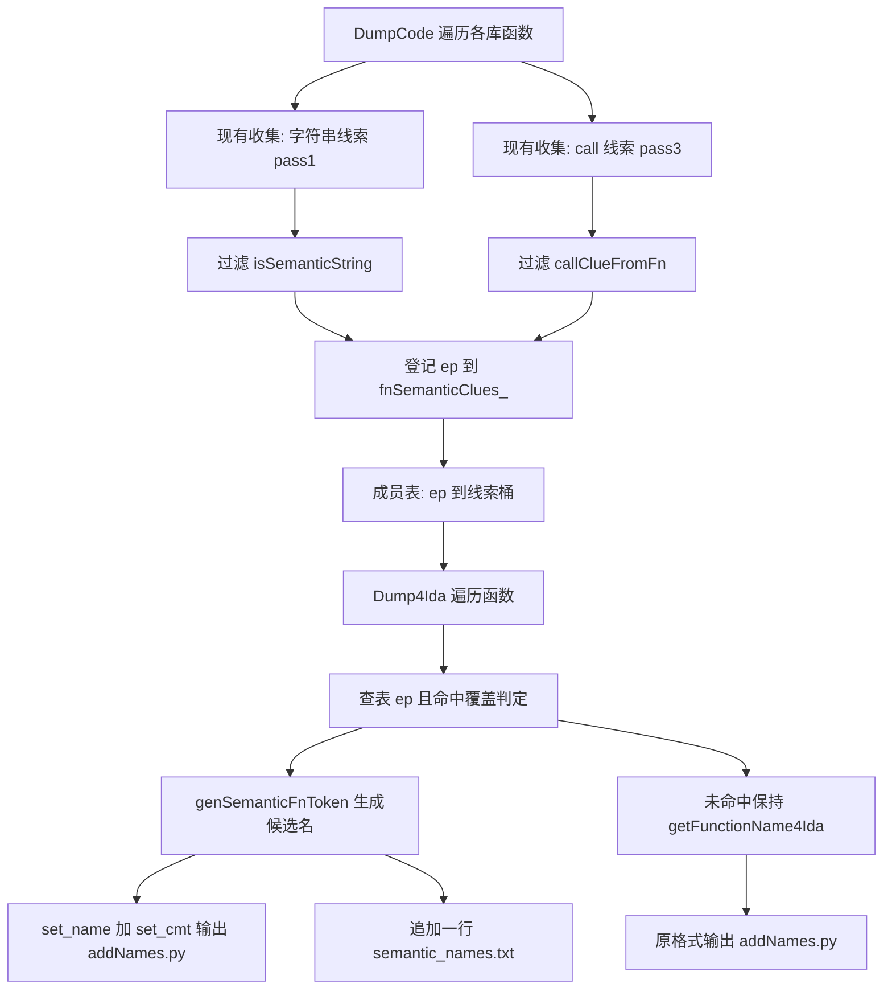

# 设计文档：IDA 语义函数重命名闭环

Feature Name: ida-semantic-fn-rename
Updated: 2026-09-03

## Description

在既有语义线索采集（`// semantic:` 注释、`strings_to_funcs.txt`）之上补全分析闭环：DumpCode 阶段把「函数 ep → 该函数引用的语义线索」登记到内存表，Dump4Ida 阶段对业务混淆库中的混淆函数（`__unknown_function__`、`_hFk` 类短名）用线索生成语义候选名并写入 `addNames.py`（`set_name` + `set_cmt`），同时输出追踪表 `semantic_names.txt`。IDA 加载 `addNames.py` 后混淆函数直接显示为 `fn_startVpn` 类可读名。

范围边界：SDK 库（url 含 `:`）函数名逐字节不变；业务库中真实语义名函数不变；`<anonymous closure>` 维持 `_anon_closure` 命名。

## Architecture



处理顺序与现状一致（main.cpp：`DumpCode` → `DumpStringCrossRef` → `Dump4Ida`），因此 `fnSemanticClues_` 在 Dump4Ida 执行前必然已填充；即使未填充（如 `NO_CODE_ANALYSIS` 构建），查表为空即退化为改动前输出。

## Components and Interfaces

### 判定与命名 helper（DartDumper.cpp 静态函数）

- `isSdkLib(const DartLibrary* lib)`：`lib->url` 含 `:` 返回 true。SDK 库永不参与语义覆盖。
- `isObfuscatedFnName(const std::string& rawName)`：
  - 强命中：`__unknown_function__`、`_ffi_resolver_function`。
  - 短名命中：剥全部前导 `_` 后核心长度 ≤ 4，且核心含大写字母或数字（`_hFk`→`hFk` 含大写 H；`Snb` 含大写 S）。全小写真实方法（`load`、`add`）不命中。
- `genSemanticFnToken(strings, calls)`：
  - 候选选取：`strings` 中第一个「无空格且净化前后一致」的标识符样条目优先；否则取第一个可净化条目（净化后非空）。
  - 候选为空时退化到 `calls`：取 `call:` 前缀后的方法段（`Class::method` → `method`），净化后作为候选。
  - 净化：非 `[A-Za-z0-9_]` 替换为 `_`，压缩连续 `_`，截断 64 字符；结果为空或以数字开头时加 `fn_` 前缀。

### DartDumper 成员与输出

- `std::unordered_map<uintptr_t, FnSemanticClues> fnSemanticClues_`（DartDumper.h 新增，`FnSemanticClues` 含 `std::vector<std::string> strings; std::vector<std::string> calls;`）。
- `DumpCode`（L608-688 循环内）：pass1 收集桶与 pass3 的 `callClues` 桶各自登记进 `fnSemanticClues_[ep]`；仅当函数经 `isObfuscatedFnName(dartFn->Name())` 命中且所属库非 SDK 时登记，控制表体积。
- `Dump4Ida`（L301-333 `dumpLib4Ida` lambda）：查 `fnSemanticClues_`；命中则：
  - `set_name` 用 `{lib}_{cls}::fn_{token}_{ep:x}` 替换原 `{lib}_{cls}::{name}_{ep:x}`；
  - 追加 `idaapi.set_cmt({ep}, "origin: {原 name}", 0)`；
  - 同目录另开 ofstream 写 `semantic_names.txt` 一行 `{addr:#x} {原名} -> fn_{token}`。
  - `HasMorphicCode` 的 `_miss`/`_check` 命名沿用原名派生，不参与语义覆盖。

### main.cpp

- 调用顺序不变（`DumpCode` 先于 `Dump4Ida`），无需修改。

## Data Models

`semantic_names.txt` 行格式（文本，无 BOM）：

```
# semantic function rename (generated by blutter)
{addr:#x} {原名} -> {语义名}
```

示例（zip 样本预期形态）：

```
0xac0540 Hip::_hFk -> fn_startVpn
```

## Correctness Properties

- 不变量 1：url 含 `:` 的库（dart:/package:）所有函数在 `addNames.py` 中的命名与改动前逐字节一致。
- 不变量 2：`<anonymous closure>` 函数命名恒为 `_anon_closure`（既有行为）。
- 不变量 3：每条 `set_name` 的 `{ep:x}` 后缀保留，全局唯一性不因覆盖而破坏。
- 不变量 4：`addNames.py` 中 `::fn_` 覆盖行数 == `semantic_names.txt` 行数 == `set_cmt` 行数。
- 不变量 5：覆盖仅当 `fnSemanticClues_` 含该 ep 且候选净化非空；候选为空时保留原名。

## Error Handling

- 无程序头/无线索等解析异常路径与现状一致，本功能不新增失败模式。
- `fnSemanticClues_` 缺失或为空（`NO_CODE_ANALYSIS`、单独调用 Dump4Ida）：查表不命中，输出与改动前相同。
- 字符串净化全部失败（候选为空）：跳过覆盖，保持原名并照常输出，不写 `semantic_names.txt` 行。

## Test Strategy

- 本地 arm64/x64 编译通过（既有 ninja 双二进制流程）。
- `scripts/regression.sh` 全量 PASS 不低于改动前（当前基线 PASS=53）。
- 新增断言（`check_common` 后按样本追加，`assert_ge`/`assert_zero`/`assert_eq` 既有 helper）：
  - `semantic_names.txt` 存在且非空（`assert_ge ... '-> fn_' 1`）。
  - `addNames.py` 含 `::fn_` 命名行，数量与 `semantic_names.txt` 行数一致。
  - zip 混淆业务线索被命名：`::fn_startVpn_` 或同类命中 ≥ 1（以实际产物校准具体 token）。
  - SDK 命名零覆盖：`addNames.py` 中 url 含 `:` 库前缀（`dartcore`、`dartio`、`dartasync` 等 `dart` 开头前缀）的行不出现 `::fn_`。
  - `assert_zero` 语义行黑名单规则继续通过（回归不变式）。
- 校准流程：先以新二进制跑两个样本，按 `semantic_names.txt` 实际内容固话各 min 断言值，再锁定回归基线并提交。
- 无 Windows 宿主限制说明：本功能改动位于解析/命名生成路径，Linux x64（winapp 样本）与 Linux arm64 二进制均覆盖执行路径；`#ifdef _WIN32` 分支不受影响。

## References

[^1]: (blutter/src/DartDumper.cpp#L571-L688) - DumpCode 语义线索收集循环
[^2]: (blutter/src/DartDumper.cpp#L290-L333) - Dump4Ida 与 dumpLib4Ida 命名输出
[^3]: (blutter/src/DartDumper.cpp#L59-L101) - isSemanticString 过滤规则
[^4]: (blutter/src/DartDumper.cpp#L180-L219) - callClueFromFn 生成 call: 线索
[^5]: (blutter/src/main.cpp#L53-L55) - DumpCode/DumpStringCrossRef/Dump4Ida 调用顺序
[^6]: (scripts/regression.sh) - 回归断言脚本与 PASS=53 基线
[^7]: (.monkeycode/specs/2026-09-03-ida-semantic-fn-rename/requirements.md) - 本功能需求文档
