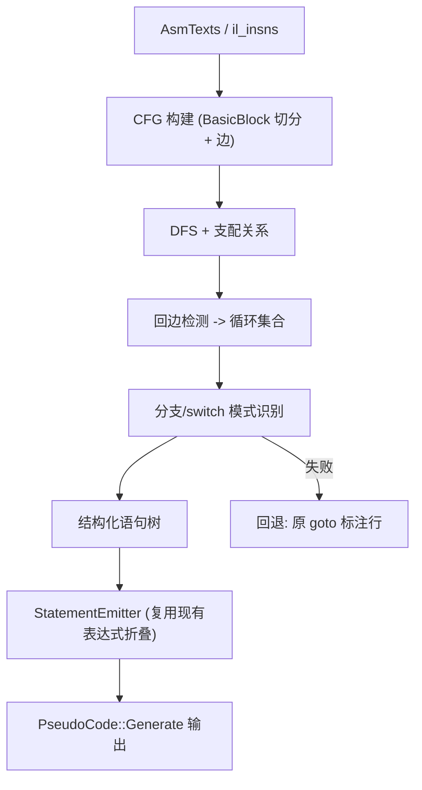

# 设计文档：Dart 控制流结构化还原

Feature Name: dart-control-flow-structuring
Updated: 2026-10-06

## Description

在 `PseudoCode` 现有的线性折叠视图（`blutter/src/PseudoCode.cpp`，单趟遍历 `asmTexts`）之前，插入一个控制流层：从同一份汇编文本构建 CFG，识别自然循环与分支汇集点，把 CFG 还原为结构化语句树；`PseudoCode::Generate` 输出的语句流按结构化语句树重新组织，未结构化区域回退为现有 `// if (...) goto 0x...` 标注。默认（未传 `-p`）不进入该层，`asm/*.dart` 逐字节不变。

控制流信息以汇编为准：现有 IL 仅对 `BranchIfSmi` 与 `CheckStackOverflow` 建模跳转目标（`il.h` 第 29、127 行），其余条件分支只存在于汇编文本。因此 CFG 构建器直接解析 `AsmText::text` 的助记符与操作数，并接受 IL 跳转目标作为覆盖输入。

## Architecture



### 阶段划分

1. **切块（BlockBuilder）**：遍历排序后的 `AsmText`。对每条跳转指令，记录其 fallthrough 地址（下一条指令地址）与目标地址；收集函数入口、所有跳转目标、跳转指令的下一条指令作为块首。
2. **建边（EdgeBuilder）**：为每个块确定 terminator（块内最后一条指令）。无条件跳转产生 1 条边；条件跳转产生目标与 fallthrough 2 条边；返回产生 0 条出边。目标越界时登记为 `external` 块（无后继）。
3. **支配与循环（LoopFinder）**：对 CFG 做 DFS 编号，边 `u -> v` 在 `v` 是 `u` 的 DFS 祖先时为回边。以回边目标为循环头，沿前驱反向求自然循环块集合，得到循环森林。
4. **结构化（Structurer）**：自顶向下匹配区域——`if/else`（条件块的两个后继在 post-dominator 处汇集）、`loops`（循环头 + 循环尾）、`switch`（同一比较表达式 + 多常量目标）。不可归约区域标记为 `goto` 区域。
5. **发射（StatementEmitter）**：结构化树按嵌套缩进输出；叶子块复用现有寄存器折叠、字段/数组、调用点逻辑（`PseudoCode.cpp` 第 468 行起的 `switch (il->Kind())`）。每条原始汇编仍输出 `// 0x... <asm>` 参考行。

## Components and Interfaces

新增文件 `blutter/src/ControlFlow.h` / `ControlFlow.cpp`：

```cpp
namespace ControlFlow {
struct BasicBlock {
    uint64_t begin, end;              // library-relative 指令地址区间 [begin,end)
    std::vector<uint64_t> succ;       // 后继块首地址
    std::vector<uint64_t> pred;
    enum TermKind { Fall, Jump, CondJump, Ret, Switch, Unknown } term;
    std::string cond;                 // 条件跳转的条件表达式文本（用于 if/loop）
    uint64_t condTarget, fallTarget;
    int loopDepth{ 0 };
    bool irreducible{ false };
};

struct LoopInfo {
    uint64_t header;
    std::set<uint64_t> body;
    uint64_t tail;
    bool preTest;                     // true => while, false => do/while
};

struct Cfg {
    std::vector<BasicBlock> blocks;   // 按地址升序
    std::unordered_map<uint64_t,size_t> addrToIdx;
    std::vector<LoopInfo> loops;
    const BasicBlock* BlockAt(uint64_t addr) const;
};

// 从 asm 文本构建 CFG；ilBranchTargets 提供 IL 已知的跳转目标覆盖。
Cfg Build(const std::vector<AsmText>& asmTexts,
          const std::unordered_map<uint64_t,uint64_t>& ilBranchTargets,
          bool isX64);

// 把 CFG 还原为结构化语句文本；失败区域用 fallback 回调输出原 goto 行。
std::string Structure(const Cfg& cfg,
                      const std::function<std::string(const BasicBlock&)>& emitBlock,
                      const std::function<std::string(const BasicBlock&)>& fallbackGoto);
} // namespace ControlFlow
```

架构识别在 `Build` 内：arm64 识别 `b`（无条件）、`b.<cond>`（条件）、`cbz`/`cbnz`/`tbz`/`tbnz`（条件）、`ret`；x64 识别 `jmp`、`j<cc>`、`ret`。条件表达式复用 `PseudoCode.cpp` 中已有的 `buildCondExpr`（第 743 行）与 `arm64CondToX64`（第 1083 行）逻辑，抽到共享 helper。

`PseudoCode::Generate`（`PseudoCode.h` 第 29 行）在构造 `asmTexts` 后调用 `ControlFlow::Build`，用 `Structure` 得到的语句序驱动输出；`PseudoCode::Generate` 的对外签名不变，默认关闭时不调用 ControlFlow。

## Data Models

- `BasicBlock.term` 与 `cond` 构成结构化的关键输入；`cond` 为已折叠的表达式文本。
- `LoopInfo.preTest`：循环头有循环外前驱则为 `while`，否则为 `do/while`。
- `Cfg.loops` 按嵌套深度升序保存，供 `Structure` 递归使用。
- 边只保存块首地址，块对象保存在 `blocks` 中，避免地址重定位问题。

## Correctness Properties

- 不变量 1：CFG 的块并集覆盖函数全部指令区间，块之间不重叠。
- 不变量 2：每条结构化语句对应的原始指令集合与 CFG 区域一致（不丢指令、不重复发射）。
- 不变量 3：关闭 `-p` 时不构建 CFG，`asm/*.dart` 逐字节不变。
- 不变量 4：不可归约区域以 `goto` 表达，结构化过程保证终止。
- 不变量 5：外部跳转目标不产生块内空洞，仅作为无后继引用。

## Error Handling

- 跳转目标越界或指向非指令地址：登记为 `external`，不参与结构匹配。
- 无法确定 terminator（未知助记符）：该块标记 `Unknown`，区域回退为原 goto 标注。
- 支配计算检测到异常：整个函数回退为线性伪代码，输出 stderr 警告一次。
- 资源保护：单函数基本块数超过阈值（如 65536）时跳过结构化，避免病态 CFG 拖慢解析。

## Test Strategy

- 单元级：对构造的合成 CFG（直线、单分支、if/else、while、do/while、嵌套循环、switch、不可归约）验证基本块切分、回边、循环集合与结构化输出。
- 集成级：对 zip/winapp 样本运行 `-p`，抽样含循环与 `switch` 的函数，人工核对结构化输出与原汇编跳转目标一致。
- 无退化：未传 `-p` 时 `cmp` 比对 `asm/*.dart` 与基线一致；传 `-p` 时失败区域应保留原始 goto 标注。
- 终止性：对任意样本限制结构化步数并断言输出生成完成。

## References

[^1]: (blutter/src/PseudoCode.cpp) - 现有线性折叠视图与分支标注（第 468、690、1099 行）
[^2]: (blutter/src/PseudoCode.h#L29) - `PseudoCode::Generate` 对外签名
[^3]: (blutter/src/CodeAnalyzer.h#L10) - `AsmText` 结构
[^4]: (blutter/src/il.h#L29) - `BranchIfSmi` 与 IL 跳转目标
[^5]: (blutter/src/DartDumper.cpp#L1020) - 伪代码输出集成点
[^6]: (.monkeycode/specs/2026-10-06-dart-control-flow-structuring/requirements.md) - 本功能需求文档
