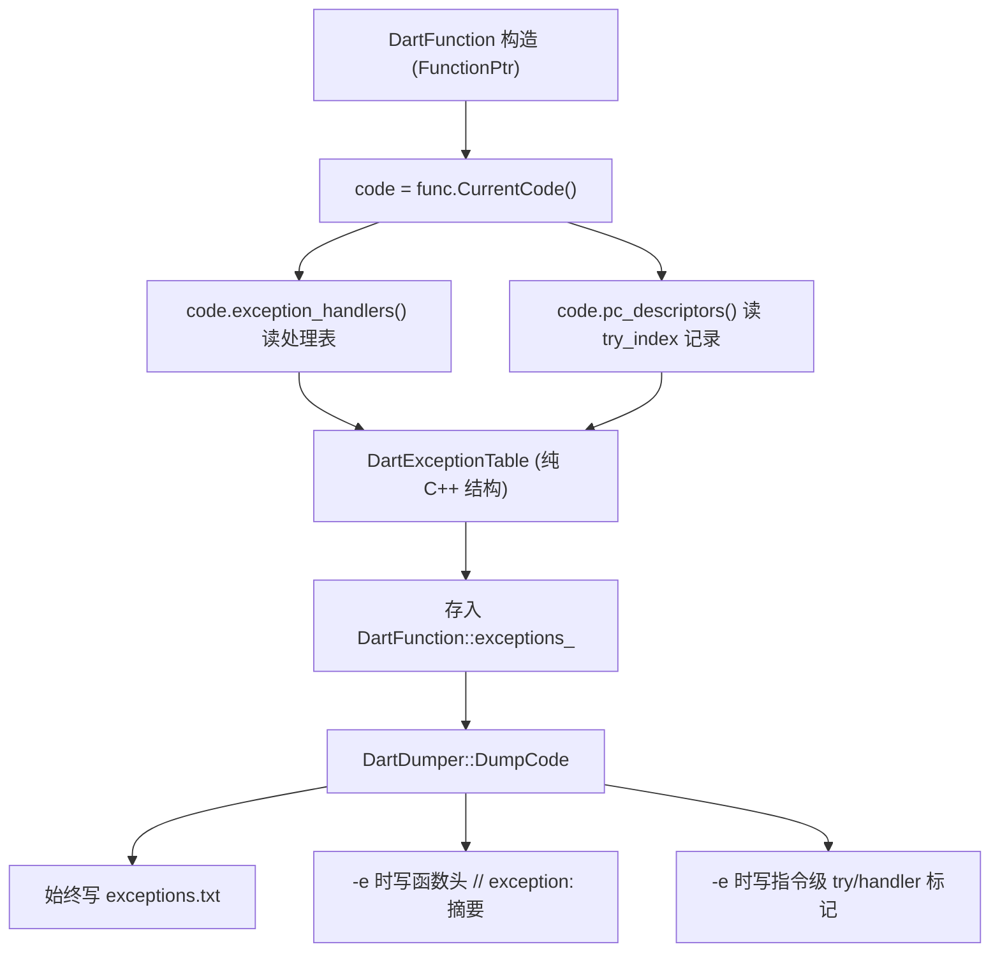

# 设计文档：Dart AOT 异常处理表解析与捕获边界标注

Feature Name: dart-exception-handler-analysis
Updated: 2026-10-06

## Description

在 `DartFunction` 构造阶段从 `dart::Code` 读取异常处理表（`ExceptionHandlers`）与 PC 描述符（`PcDescriptors` 的 try_index），抽取为与 Dart 运行时对象解耦的纯 C++ 结构，保存到 `DartFunction`。`DartDumper::DumpCode` 在输出函数时：

- 始终写出一份独立的 `exceptions.txt`（按函数列出处理表与 try 区域），不改动既有 asm 产物；
- 当命令行开启异常视图（新增 `-e` / `--exception`）时，在 `asm/*.dart` 的函数头追加 `// exception:` 摘要，并在指令注释中标注 `try<i>` / `handler<i>`；
- 默认关闭异常视图，`asm/*.dart` 与改动前逐字节一致（与 `-p` 伪代码同一约定）。

异常表的语义模型来自 Dart VM：`Code.exception_handlers()` 给出每个 try_index 的 handler PC 偏移与 `outer_try_index`（嵌套关系），`Code.pc_descriptors()` 给出每条 PC 记录的 `try_index`（即该 PC 处于哪个 try 保护区），`handled_types_data` 给出每个 try_index 捕获的类型列表。handler PC 偏移与 PC 描述符偏移均相对 `Code.PayloadStart()`。

## Architecture



数据流与现有 `FnSemanticClues` 一致：抽取期（`LoadInfo`，isolate 存活）访问 `dart::` 对象并复制为普通结构；输出期（`DumpCode`）只使用普通结构，不再触碰 VM 对象，避免类型 DB 未就绪或快照卸载后的崩溃。

## Components and Interfaces

### DartFunction.h 新增结构

```cpp
struct DartExceptionCatch {
    std::string typeName;   // 捕获类型可读名，如 "Object" / "RangeError"
};

struct DartExceptionHandler {
    int32_t tryIndex{ -1 };
    uint64_t handlerPc{ 0 };      // library-relative (payload_addr + handler_pc_offset)
    int32_t outerTryIndex{ -1 };
    bool hasCatchAll{ false };
    bool isGenerated{ false };
    bool needsStackTrace{ false };
    std::vector<DartExceptionCatch> catches;
};

struct DartTryRange {
    int32_t tryIndex{ -1 };
    uint64_t begin{ 0 };   // library-relative, inclusive
    uint64_t end{ 0 };     // library-relative, exclusive (== next pc after last record)
};

struct DartExceptionTable {
    bool present{ false };
    std::vector<DartExceptionHandler> handlers;
    std::vector<DartTryRange> tryRanges;
};
```

`DartFunction` 增加成员 `DartExceptionTable exceptions_;` 与访问器 `const DartExceptionTable& Exceptions() const;`。

### 提取：DartFunction.cpp

在 `DartFunction::DartFunction(DartClass&, const dart::FunctionPtr)` 已取得 `const auto& code = dart::Code::Handle(zone, func.CurrentCode());`（当前第 71 行）之后，调用新增的静态 helper：

```cpp
static void ExtractExceptions(dart::Zone* zone, const dart::Code& code,
                              intptr_t lib_base, DartExceptionTable& out);
```

实现要点：

1. `const auto& handlers = dart::ExceptionHandlers::Handle(zone, code.exception_handlers());`
2. `intptr_t n = handlers.num_entries();` 逐行 `dart::ExceptionHandlerInfo info; handlers.GetHandlerInfo(i, &info);`
   - `handlerPc = code.PayloadStart() - lib_base + info.handler_pc_offset;`
   - `outerTryIndex = info.outer_try_index; hasCatchAll = info.has_catch_all != 0; isGenerated = info.is_generated != 0; needsStackTrace = info.needs_stacktrace != 0;`
   - `handled_types = dart::Array::Handle(zone, handlers.GetHandledTypes(i));` 非空时逐项 `dart::AbstractType::Handle(...).ToCString()` 存入 `catches`。
3. PC 描述符：`const auto& pcs = dart::PcDescriptors::Handle(zone, code.pc_descriptors());` 用 `dart::PcDescriptors::Iterator it(pcs, dart::UntaggedPcDescriptors::kAnyKind);` 迭代，读取 `it.PcOffset()` 与 `it.TryIndex()`，累计成 `DartTryRange`（相邻同 try_index 的 PC 合并区间，`end` 为下一个不同 try_index 的 PC 或函数末地址）。
4. `code.Size()` 为 `-1`（UnknownDartCode）或 `num_entries()==0` 且无 PC 记录时，`out.present = false`。

注意：`DartFunction(DartClass&, const dart::Code&)`（混淆样本裸 Code 构造，第 123 行）同样调用 `ExtractExceptions`，使无 `Function` 对象的函数也能拿到异常表。

### 输出：DartDumper.cpp

- `DumpCode` 打开一个 `std::ofstream excOf(outDir / "exceptions.txt")`，在遍历每个函数时写：

  ```text
  [package:foo/bar.dart] MyClass::method @0xac0540
    try0 handler=0xac06b0 outer=-1 catch_all=0 generated=0
      0. Object
      1. RangeError
    try1 handler=0xac0720 outer=0 catch_all=1 generated=0
    ranges: try0 [0xac0500,0xac069c)  try1 [0xac0600,0xac0704)
  ```

- 指令级标记复用现有 asm 输出循环（`DartDumper.cpp` 第 948 行起 `for (auto& asmText : asmTexts)`）：为每条 `asmText.addr` 查询所属 try_index，命中时把 `try<i>` 追加到已有的 `extra` 描述后；命中 handler 起始地址时追加 `handler<i>`。查询用按地址排序的 `tryRanges` 二分（`std::upper_bound`）。
- 函数头摘要插入在 `dartFn->PrintHead(of)` 之后（`asmTexts` 空判断附近），仅当 `PseudoCode` 同级的开关 `ExceptionView` 打开。开关放在 `DartDumper` 或全局配置中，由 `main.cpp` 的 `-e/--exception` 解析设置（参照现有 `-p/--pseudo` 的 `PseudoCode::SetEnabled`）。

### main.cpp

新增 `args::Flag exception`（`--exception` / `-e`），解析后调用 `SetExceptionViewEnabled(true)`。默认 false。

## Data Models

`DartExceptionHandler.catches` 为捕获类型名列表，顺序与 `handled_types_data` 一致（编译器已按源码 catch 从句顺序排列）。`DartTryRange` 由 PC 描述符归并得到，可能不连续，故保存为区间列表而非单一起止。

## Correctness Properties

- 不变量 1：异常视图关闭且无 `-e` 时，`asm/*.dart` 与改动前逐字节一致（新增写入仅落在独立的 `exceptions.txt`）。
- 不变量 2：`handlerPc` 与 `tryRanges` 的地址均与 `asmText.addr` 处于同一 library-relative 基准，可直接比较。
- 不变量 3：`DartExceptionTable.present == false` 时，不向 `exceptions.txt` 写该函数的异常段。
- 不变量 4：`outerTryIndex` 指向的行号必然小于当前行号（Dart VM 保证外层 try 先分配），用于展示嵌套关系。
- 不变量 5：`NO_CODE_ANALYSIS` 构建下不编译提取与输出代码，产物与改动前一致。

## Error Handling

- `code.exception_handlers()` 为空对象或 `num_entries()==0`：视为无异常表，`present=false`，不写输出。
- `GetHandledTypes` 返回空或类型名解析失败：该 catch 项写入占位名 `?`，不抛异常。
- PC 描述符迭代遇到畸形记录：捕获 `dart::` 侧可能抛出的异常，丢弃当前函数 PC 区间并输出 stderr 警告，继续解析。
- 混淆样本 `Code.Size()==-1`：`handlerPc` 由 `payload_addr` 计算得 `ep_addr`，`present` 依 PC 记录是否存在而定；不因桩对象崩溃。

## Test Strategy

- 语法与编译：先以 `clang++-16 -fsyntax-only` 对改动的 C++ 文件做单文件语法检查（无完整 Dart 头时用现有 `winstub`/stub 手法）；再用 `scripts/build.py build-dartvm` + `build-blutter` 完整构建一个版本（默认 3.3.4）。
- 结构自检：对已知含 try/catch 的样本（Android arm64 `libapp.so`、Windows x64 `app.so`）运行 `-e`，核对 `exceptions.txt` 中 handler 地址落在反汇编区间内、catch 类型名非空、嵌套层级合理。
- 无退化：关闭 `-e` 运行，比对 `asm/*.dart` 与改动前基线逐字节一致（`cmp`）。
- 边界样本：无 try 的函数不产生异常段；`NO_CODE_ANALYSIS` 变体输出不变。

## References

[^1]: (blutter/src/DartFunction.cpp#L71) - 现有 `Code` 取得点，异常提取插入位置
[^2]: (blutter/src/DartFunction.h#L81-L91) - `DartFunctionSignature` 与 `AnalyzedData` 访问器，新增结构参照
[^3]: (runtime/vm/object.h) - `Code::exception_handlers()` / `Code::pc_descriptors()` / `PcDescriptors::Iterator::TryIndex()`
[^4]: (runtime/vm/exceptions.h) - `ExceptionHandlerInfo` 字段定义
[^5]: (runtime/vm/exceptions.cc#L314) - `pc_offset = pc - Code.PayloadStart()` 偏移基准
[^6]: (runtime/docs/compiler/exceptions.md) - AOT 异常模型与 CatchEntryMoves
[^7]: (.monkeycode/specs/2026-10-06-dart-exception-handler-analysis/requirements.md) - 本功能需求文档
