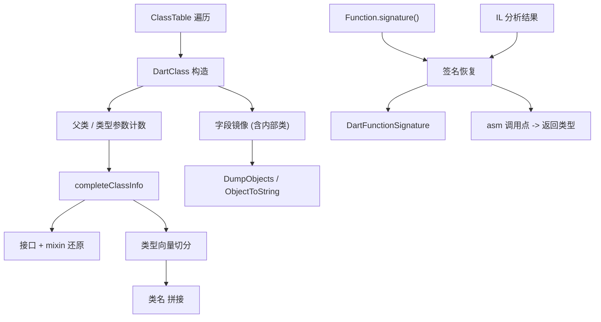

# 设计文档：Dart 类型与符号恢复增强

Feature Name: dart-type-symbol-recovery
Updated: 2026-10-06

## Description

补齐 blutter 在四个方向上的类型/符号恢复：

1. **内部类字段镜像**：`DartClass` 构造函数当前在 `id <= dart::kLastInternalOnlyCid` 时直接返回（`DartClass.cpp` 第 37 行），跳过字段表与父类。改为在返回前尝试读取字段表，区分“内部但有 Dart 字段”的类（如 `_Enum`）与“原生无字段”的类。
2. **类层级**：`DartApp::completeClassInfo` 对变换混入类只取 `interfaces().At(--len)` 作为 mixin（`DartApp.cpp` 第 441-452 行），改为还原完整的 extends + 有序 mixin + 全部接口。
3. **泛型实参**：修正类型向量的子向量切分，补齐实例与函数参数的类型实参输出（`DartApp.cpp` 第 432-438 行、`CodeAnalyzer_arm64.cpp` 第 996/1835 行的 TODO）。
4. **函数签名**：`DartApp.cpp` 第 727 行 TODO 与第 769 行“Signature is dropped in most function”，改为从 `FunctionType` 与 IL 分析两路回填返回类型与参数类型。

改动集中在 `DartClass.cpp/.h`、`DartApp.cpp`、`DartFunction.cpp/.h`、`DartTypes.cpp`、`DartDumper.cpp`，均为增量，不改变默认 `asm/*.dart` 的汇编主体。

## Architecture

## Components and Interfaces

### DartClass.cpp / DartClass.h

- 将第 37-41 行的早退拆分为两步：先判定 `!cls.is_loaded()`（真正无信息则返回），再对 `id <= kLastInternalOnlyCid` 尝试读取 `cls.fields()`。
- 字段读取循环（现有第 88 行起）抽成 `void loadFields(dart::Zone* zone, const dart::Class& cls)`，内部类与普通类共用；字段为空时不建立映射。
- `DartClass` 增加 `bool fieldsLoaded{ false };` 与 `bool isInternalOnly{ false };`，供输出层判断“无字段”与“字段缺失”的区别。

### DartApp.cpp

- **接口与 mixin**（第 441 行区域）：
  - 对变换混入类，按合成类名 `_<child>&<extends>&<mixin...>` 解析：第一段为真实 extends，其余段为有序 mixin；`interfaces()` 中非 mixin 项作为实现接口保存。
  - 移除“只取最后一个接口”的逻辑，改为把全部接口与全部 mixin 分别保存到 `DartClass::interfaces` 与 `DartClass::mixins`。
- **类型向量**（第 432-438 行）：以 `declarationType->Arguments()` 为完整向量，按 `num_type_parameters`（子类）与 `superCls->num_type_parameters`（父类）切分，父类段长度从类型向量尾部对齐，避免“复杂泛型下子向量可能错误”。
- **函数签名回填**（第 727 行、第 769-810 行）：
  - 对 `func.signature()` 为堆对象的函数，现有读取逻辑保留并补齐 `type_parameters` 名称列表。
  - 对签名被丢弃的函数，等 `CodeAnalyzer::AnalyzeAll` 完成后，从 `AnalyzedFnData` 的 `params` 与 `returnType` 回填 `signature.returnType` 与每个 `FnParam.type`。
  - 闭包在其 `parent` 解析完成后（第 715-724 行循环之后）统一回填。

### DartTypes.cpp / DartFunction.cpp

- `DartFunction::ReturnType()` 当前返回 `dart::kIllegalCid`（`DartFnBase.h` 第 31 行）；改为在签名可用时返回 `signature.returnType` 的 cid。
- `DartFunctionSignature`（`DartFunction.h` 第 20-34 行）增加 `std::vector<std::string> typeParameterNames;` 与访问器。

### DartDumper.cpp

- `ObjectToString` / `dumpInstance` 在类名后拼接类型实参（现有 `[lib.url] Class<args>` 逻辑处），仅当实参解析成功。
- 内部类字段镜像后，`dumpInstanceFields`（第 42 行声明）对 `_Enum` 之类实例输出字段名；`enumValueName`（第 46 行）在字段镜像可用时优先用字段名定位 `_name`，否则沿用固定 8 字节前进的启发式。

### 调用点类型传播（CodeAnalyzer）

- arm64 / x64 在登记参数类型时（`CodeAnalyzer_arm64.cpp` 第 996、1835 行），若参数类型为泛型类，附带其实例类型实参文本，替换现有 `TODO: class with type arguments`。

## Data Models

- `DartClass` 新增：`std::vector<DartClass*> mixins;`、`bool fieldsLoaded;`、`bool isInternalOnly;`。
- `DartFunctionSignature` 新增：`std::vector<std::string> typeParameterNames;`。
- 类型向量沿用 `DartClass::typeVectorName` / `parentTypeVectorName`，切分规则改为“尾部对齐”。

## Correctness Properties

- 不变量 1：字段镜像的偏移与 `DartField` 的偏移一致，重复偏移以首个定义为准。
- 不变量 2：父类指针非堆指针时 `superCls` 为空，不产生悬垂引用。
- 不变量 3：变换混入类还原后的 mixin 顺序与源码 `with` 顺序一致。
- 不变量 4：类型向量子向量长度之和不超过完整向量长度。
- 不变量 5：签名回填只在原签名为空时进行，已有签名不被覆盖。
- 不变量 6：内部类字段读取失败不抛异常到顶层。

## Error Handling

- `cls.fields()` 访问失败或返回空：记录 `fieldsLoaded=false`，不建立映射。
- 泛型实参解析失败：省略 `<args>` 段，输出裸类名。
- 签名回填时 IL 数据缺失：保持原空签名，不影响反汇编。
- 类型向量切分越界：退化为完整向量，记录 stderr 警告一次。
- 全部失败路径均不中断解析，实例输出回退到 `UnhandledClass(name, cid=N)`。

## Test Strategy

- 字段：对含 enum 的样本，核对 `objs.txt` / `pp.txt` 中 enum 实例输出 `EnumName.value` 与字段名命中数较改动前增加且无回归。
- 层级：核对若干已知类的父类/接口/mixin 列表与源码一致。
- 泛型：核对 `List<int>`、`Map<String, dynamic>` 等实例的类型实参输出正确。
- 签名：核对有 `FunctionType` 的函数参数名/类型完整；签名被丢弃的函数至少返回类型可推断。
- 无退化：`asm/*.dart` 在未开启新增输出时与基线逐字节一致；`NO_CODE_ANALYSIS` 变体输出不变。

## References

[^1]: (blutter/src/DartClass.cpp#L37-L41) - 内部类早退
[^2]: (blutter/src/DartApp.cpp#L432-L452) - 类型向量与接口/mixin（含第 441 行 TODO）
[^3]: (blutter/src/DartApp.cpp#L727) - 函数结果/参数类型 TODO
[^4]: (blutter/src/DartApp.cpp#L769-L810) - 签名读取与“Signature is dropped”说明
[^5]: (blutter/src/DartFunction.h#L20-L34) - `DartFunctionSignature`
[^6]: (blutter/src/CodeAnalyzer_arm64.cpp#L996) - 泛型类参数类型 TODO
[^7]: (blutter/src/DartDumper.cpp#L1391) - `UnhandledClass` 回退
[^8]: (.monkeycode/specs/2026-10-06-dart-type-symbol-recovery/requirements.md) - 本功能需求文档
