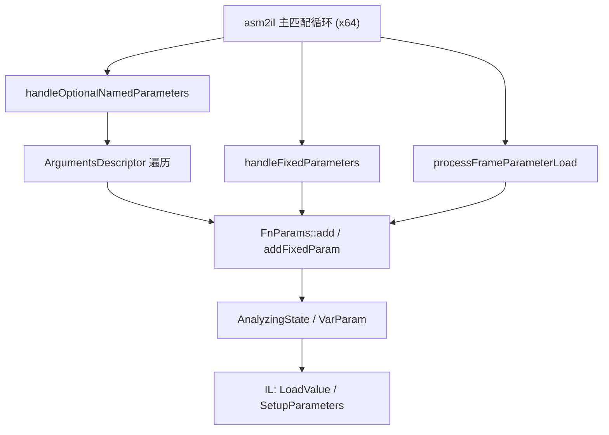

# 设计文档：x64 IL 分析器对齐 arm64

Feature Name: x64-analyzer-parity
Updated: 2026-10-06

## Description

把 `CodeAnalyzer_arm64.cpp` 中已经成熟的参数 prologue 分析移植到 `CodeAnalyzer_x64.cpp`：

- 新增 `handleFixedParameters`，在 prologue 中按调用约定登记固定参数（对应 arm64 第 954 行）。
- 用完整实现替换 `handleOptionalNamedParameters` 的占位（当前第 1627 行），包括命名参数名称匹配、`required` 处理、名称/位置字段区分与临时变量清理（对应 arm64 第 1149 行）。
- 绑定索引式参数槽读取 `[fp + reg*4 + disp]` 到 IL 参数。

两架构共享 IL 层（`il.h`、`VarValue.h`、`CodeAnalyzer.h` 的 `FnParams` / `AnalyzingState` / `AnalyzingVars`），差异集中在寻址方式（x64 变长指令、内存操作数）与寄存器 ABI。移植以 arm64 逻辑为蓝本，参数化架构相关的常量与寄存器解析。

## Architecture

新增/修改的 handler 在 `FunctionAnalyzer` 内按 arm64 同样的调用点接入 `asm2il` 主循环，摆在现有 `handleArgumentsDescriptorTypeArguments`（第 1643 行）之前。

## Components and Interfaces

### CodeAnalyzer_x64.cpp

1. **`void handleFixedParameters(AsmIterator& insn, x86_reg paramCntReg, int paramCnt = 0)`**
   - 对应 arm64 `handleFixedParameters`（第 954 行）。识别参数保存模式：从参数寄存器/实参向量槽加载并存入局部槽。
   - x64 调用约定：Windows x64 前 4 个实参走 `rcx`/`rdx`/`r8`/`r9`，其余走栈；但 Dart AOT 内部约定的“参数寄存器”以 IL 层的 `A64::Register` 别名为准（x64 上为寄存器索引），移植时沿用同一别名映射。
   - 上界取 `dartFn->NumParam()`；为 0 时取 `INT_MAX`（沿用当前第 1553-1555 行的处理）。

2. **`void handleOptionalNamedParameters(AsmIterator& insn, x86_reg paramCntReg)`（替换占位）**
   - 对应 arm64 第 1149 行。核心步骤：
     a. 识别 `mov reg, [ArgumentsDescriptor + first_named_entry_offset - kHeapObjectTag]` 起始加载；
     b. 依 `AOT_ArgumentsDescriptor_named_entry_size` 步进，读取参数名称与位置；
     c. 与 `fnInfo->params` 中按字典序排列的可选命名参数逐一比较，处理 `required` 跳过、最后一项与未使用参数；
     d. 结束时清除 `valNameParamName` / `valNameArgIdx` / `currParamOffset` 等临时变量。
   - 名称与位置字段的区分沿用 arm64 的 `name_offset` / `position_offset` 判定（第 1299-1362 行）。

3. **索引参数槽绑定**
   - 在 `processFrameParameterLoad`（第 1273 行）与主循环中，识别 `[fp + idxReg*4 + disp]`；当 `idxReg` 已被标记为命名参数索引变量时，把读取绑定到 `FnParams` 对应参数（复用 `fnInfo->params.findValReg` / `movValReg`）。

4. **去除 `TODO(gap-4)` 注释块**（第 17-25 行）：两项完成后更新块内容为“已完成”。

### 共享结构

不修改 `CodeAnalyzer.h` 的公共结构；仅使用现有 `FnParams`、`FnParamInfo`、`AnalyzingState::SetLocal/GetLocal`、`AnalyzingVars::ValParam/ValArgsDesc/ValCurrNumNameParam`。

## Data Models

- 命名参数索引：`VarValue` 子类型（现有 `VarParam`、`ValCurrNumNameParam`）承载；x64 侧新增的临时变量沿用 `AnalyzingVars::pending_ils` 机制在 prologue 结束后落地。
- 参数槽映射：`FnParamInfo::paramOffset`（相对 FP）与 `localOffset` 由新 handler 填写。

## Correctness Properties

- 不变量 1：`FnParams::NumOptionalParam()` 与 `DartFunction::NumOptionalParam()` 在分析完成后一致（对有签名的函数）。
- 不变量 2：命名参数名称匹配顺序与 `FunctionType` 的字典序一致。
- 不变量 3：无可选/命名参数的函数不进入新 handler 的主体分支，IL 与产物不变。
- 不变量 4：新 handler 失败时回滚 `AsmIterator`（沿用 `INSN_ASSERT` 的自动回滚语义）并返回，不产生半登记参数。
- 不变量 5：所有 ArgumentsDescriptor 偏移取自 `dart::` 常量，两架构共用同一来源。

## Error Handling

- prologue 模式不匹配：`INSN_ASSERT` 触发回滚，`handleOptionalNamedParameters` 返回，主循环继续处理后续指令。
- ArgumentsDescriptor 未加载或值为空：跳过可选/命名参数扫描，退回固定参数结果。
- 参数个数与 ArgumentsDescriptor 不一致：以 ArgumentsDescriptor 为准并输出一次 stderr 警告。
- 未识别的 x64 寻址形式：记录为未知模式，不登记参数，不中断。

## Test Strategy

- 语法：优先完成完整 x64 构建（`scripts/build.py build-dartvm --arch x86_64` + `build-blutter --arch x86_64`）。
- 功能：对 Flutter Windows 桌面样本 `app.so` 运行，抽样含可选/命名参数的函数，核对 `asm/*.dart` 中参数名、`arg_i` 绑定与调用点参数个数。
- 对照：同一逻辑函数在 arm64 样本上的输出作为对照，检查结构一致。
- 无退化：无 `-p` 与有 `-p` 情况下，未含可选/命名参数的函数产物与基线逐字节一致。

## References

[^1]: (blutter/src/CodeAnalyzer_x64.cpp#L17-L25) - `TODO(gap-4)` 原始描述
[^2]: (blutter/src/CodeAnalyzer_x64.cpp#L1627-L1642) - 占位 `handleOptionalNamedParameters`
[^3]: (blutter/src/CodeAnalyzer_x64.cpp#L1273) - `processFrameParameterLoad`
[^4]: (blutter/src/CodeAnalyzer_arm64.cpp#L954) - `handleFixedParameters`
[^5]: (blutter/src/CodeAnalyzer_arm64.cpp#L1149-L1565) - `handleOptionalNamedParameters`
[^6]: (blutter/src/CodeAnalyzer.h#L96-L140) - `FnParams` / `AnalyzingState` / `AnalyzingVars`
[^7]: (.monkeycode/specs/2026-10-06-x64-analyzer-parity/requirements.md) - 本功能需求文档
